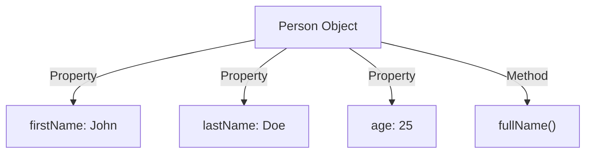
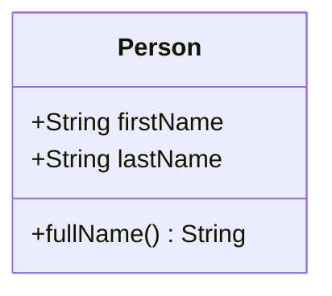
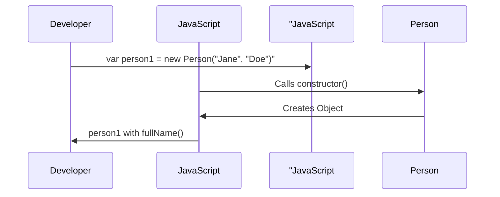
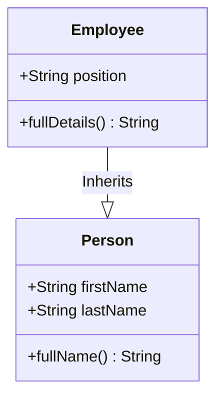
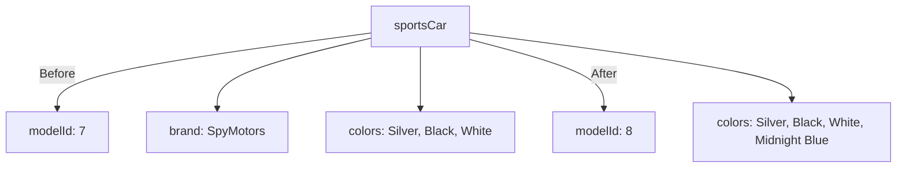
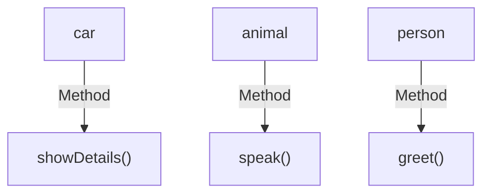
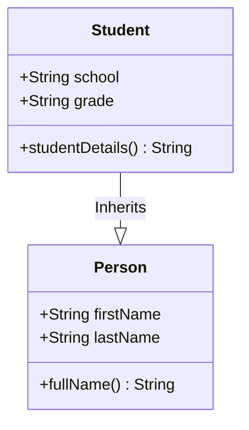
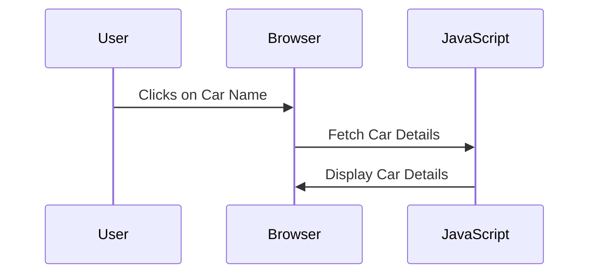

# JavaScript Objects, Classes, and Inheritance: A Comprehensive Guide

## Table of Contents

- [JavaScript Objects, Classes, and Inheritance: A Comprehensive Guide](#javascript-objects-classes-and-inheritance-a-comprehensive-guide)
  - [Table of Contents](#table-of-contents)
  - [Introduction](#introduction)
  - [Understanding JavaScript Objects](#understanding-javascript-objects)
    - [What are Objects?](#what-are-objects)
    - [Accessing Properties and Methods](#accessing-properties-and-methods)
  - [Classes and Constructors](#classes-and-constructors)
    - [Class Definition](#class-definition)
    - [Constructor Function](#constructor-function)
  - [Inheritance and Subclassing](#inheritance-and-subclassing)
    - [Subclassing Example](#subclassing-example)
  - [Practical Exercises](#practical-exercises)
    - [Basic Exercises](#basic-exercises)
      - [Exercise 1: Creating and Modifying Objects](#exercise-1-creating-and-modifying-objects)
      - [Exercise 2: Creating Objects with Methods](#exercise-2-creating-objects-with-methods)
    - [Intermediate Exercises](#intermediate-exercises)
      - [Exercise 1: Extending Classes](#exercise-1-extending-classes)
    - [Challenge](#challenge)
  - [Conclusion](#conclusion)
  - [Additional Resources](#additional-resources)

---

## Introduction

This guide will provide you with a comprehensive understanding of JavaScript objects, classes, and inheritance. We will explore how to work with objects, define and utilize classes, and extend classes through inheritance. By the end, you'll have practical knowledge for building robust, object-oriented JavaScript applications.

---

## Understanding JavaScript Objects

### What are Objects?

In JavaScript, objects are collections of properties and methods. Properties are variables that belong to an object, and methods are functions that are associated with the object.

**Example:**

```javascript
var person = {
    firstName: "John",
    lastName: "Doe",
    age: 25,
    fullName: function() {
        return this.firstName + " " + this.lastName;
    }
};
```

Here, `firstName`, `lastName`, and `age` are properties, while `fullName` is a method that returns the full name of the person.

**Diagram: Object Structure**



### Accessing Properties and Methods

To access properties and methods in an object, use dot notation or bracket notation.

**Example:**

```javascript
console.log(person.firstName); // Outputs: John
console.log(person['lastName']); // Outputs: Doe
console.log(person.fullName()); // Outputs: John Doe
```

---

## Classes and Constructors

### Class Definition

Classes in JavaScript are blueprints for creating objects. They allow you to define the structure of your objects, including their properties and methods.

**Example:**

```javascript
class Person {
    constructor(firstName, lastName) {
        this.firstName = firstName;
        this.lastName = lastName;
    }

    fullName() {
        return this.firstName + " " + this.lastName;
    }
}
```

**Diagram: Class Definition**



### Constructor Function

The `constructor` is a special function within a class that is automatically called when an object is created. It’s used to initialize object properties.

**Example:**

```javascript
var person1 = new Person("Jane", "Doe");
console.log(person1.fullName()); // Outputs: Jane Doe
```

**Diagram: Constructor Call**



---

## Inheritance and Subclassing

Inheritance allows you to create new classes based on existing ones, inheriting their properties and methods. The `extends` keyword is used to define a subclass, and `super()` is used to call the constructor of the parent class.

### Subclassing Example

```javascript
class Employee extends Person {
    constructor(firstName, lastName, position) {
        super(firstName, lastName);
        this.position = position;
    }

    fullDetails() {
        return `${this.fullName()} - ${this.position}`;
    }
}

let emp = new Employee("Jane", "Doe", "Developer");
console.log(emp.fullDetails()); // Outputs: Jane Doe - Developer
```

**Diagram: Inheritance Structure**



---

## Practical Exercises

### Basic Exercises

#### Exercise 1: Creating and Modifying Objects

Create an object called `sportsCar` with the following properties:

- `modelId`: 7
- `brand`: "SpyMotors"
- `model`: "Spectre"
- `colors`: ["Silver", "Black", "White"]

**Task:**

- Print the object to the console.
- Update the `modelId` to 8.
- Add "Midnight Blue" to the array of colors.
- Print the updated object to the console.

**Solution:**

```javascript
var sportsCar = {
    modelId: 7,
    brand: "SpyMotors",
    model: "Spectre",
    colors: ["Silver", "Black", "White"]
};

console.log(sportsCar);

sportsCar.modelId = 8;
sportsCar.colors.push("Midnight Blue");

console.log(sportsCar);
```

**Diagram: Object Modifications**



#### Exercise 2: Creating Objects with Methods

Create three objects representing a car, an animal, and a person. Each object should have at least one method that logs some of its properties.

**Solution:**

```javascript
var car = {
    brand: "Tesla",
    model: "Model S",
    showDetails: function() {
        console.log(this.brand + " " + this.model);
    }
};

var animal = {
    type: "Dog",
    name: "Buddy",
    speak: function() {
        console.log(this.name + " says Woof!");
    }
};

var person = {
    firstName: "Alice",
    lastName: "Smith",
    greet: function() {
        console.log("Hello, " + this.firstName + " " + this.lastName);
    }
};

car.showDetails();
animal.speak();
person.greet();
```

**Diagram: Multiple Object Methods**



---

### Intermediate Exercises

#### Exercise 1: Extending Classes

Extend the `Person` class to create a `Student` class with additional properties such as `school` and `grade`. Include a method that prints out the full name and school of the student.

**Solution:**

```javascript
class Student extends Person {
    constructor(firstName, lastName, school, grade) {
        super(firstName, lastName);
        this.school = school;
        this.grade = grade;
    }

    studentDetails() {
        return `${this.fullName()} is in grade ${this.grade} at ${this.school}.`;
    }
}

let student1 = new Student("Charlie", "Brown", "Central High", "10th");
console.log(student1.studentDetails());
```

**Diagram: Student Class Extension**



---

### Challenge

Create a small web application where users can view a list of cars. When a car name is clicked, its details (model, year, price) will appear on the page.

**Instructions:**

- Create an array of car objects with properties like `name`, `year`, and `price`.
- Use a loop to display car names in a list.
- When a car name is clicked, show the details of the selected car.

**Solution Skeleton:**

```html
<!DOCTYPE html>
<html

 lang="en">
<head>
    <meta charset="UTF-8">
    <title>Car Shop</title>
    <style>
        #car-details { display: none; }
    </style>
</head>
<body>
    <ul id="car-list"></ul>
    <div id="car-details"></div>

    <script>
        var cars = [
            { name: "Tesla Model S", year: 2020, price: "$80,000" },
            { name: "BMW i8", year: 2019, price: "$140,000" },
        ];

        var carList = document.getElementById('car-list');
        var carDetails = document.getElementById('car-details');

        cars.forEach(function(car) {
            var listItem = document.createElement('li');
            listItem.textContent = car.name;
            listItem.addEventListener('click', function() {
                carDetails.textContent = `Model: ${car.name}, Year: ${car.year}, Price: ${car.price}`;
                carDetails.style.display = 'block';
            });
            carList.appendChild(listItem);
        });
    </script>
</body>
</html>
```

**Diagram: Car Selection Interaction**



---

## Conclusion

This guide has introduced you to JavaScript objects, classes, and inheritance, and shown how to apply these concepts through practical exercises. By mastering these techniques, you can create more organized, modular, and maintainable code.

---

## Additional Resources

- **MDN Web Docs:**
  - [JavaScript Objects](https://developer.mozilla.org/en-US/docs/Learn/JavaScript/Objects)
  - [Classes](https://developer.mozilla.org/en-US/docs/Web/JavaScript/Reference/Classes)
  - [Inheritance](https://developer.mozilla.org/en-US/docs/Learn/JavaScript/Objects/Inheritance)
  
---
